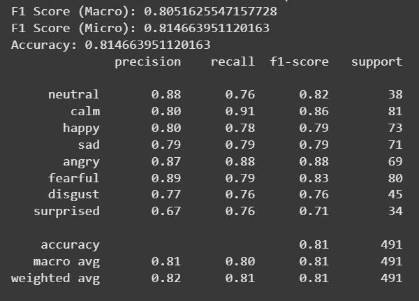
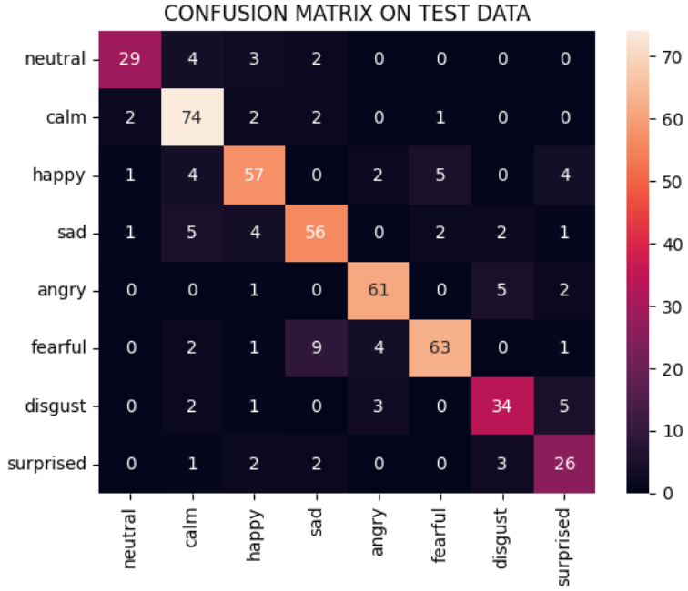
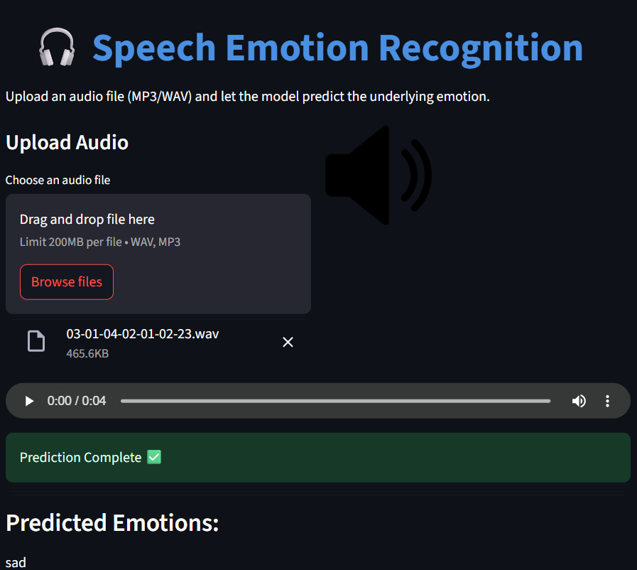

# 🎙️ Speech Emotion Recognition using Deep Learning

This project is a **speech emotion recognition system** built with deep learning, trained on the **RAVDESS dataset** (speech and song combined). It features an interactive **Streamlit web app** for real-time inference using `.wav` or `.mp3` files.

---

## 🚀 Project Highlights

- 🎧 Feature-rich audio processing pipeline (MFCC, Chroma, Delta, etc.)
- 🧠 Deep Neural Network with PCA-based dimensionality reduction
- 🌐 Streamlit web app for real-time emotion classification
- 📊 Achieved >81% accuracy and F1-score on 8 emotion classes

---

## 🧪 Emotion Classes

The model classifies input audio into one of the following emotions:

- `Neutral`
- `Calm`
- `Happy`
- `Sad`
- `Angry`
- `Fearful`
- `Disgust`
- `Surprised`

---

## 🎧 Audio Feature Extraction

We extracted a diverse set of **temporal**, **spectral**, and **delta** features using `librosa`. Each feature was summarized using **mean** and **standard deviation**, resulting in a **556-dimensional feature vector**.

### 🔍 Extracted Features

#### 🔹 Temporal Features
- Root Mean Square Energy (RMS)
- Zero Crossing Rate (ZCR)
- Spectral Centroid
- Spectral Bandwidth
- Spectral Rolloff

#### 🔹 Spectral Features
- MFCCs (40 Mel-frequency cepstral coefficients)
- Chroma Frequencies (12)
- Mel Spectrogram (128 filters)
- Spectral Contrast (7 bands)
- Tonnetz (6 tonal centroid features)

#### 🔹 Delta Features
- Δ MFCC (First derivative)
- Δ² MFCC (Second derivative)

Each of these features was summarized using:
- **Mean**
- **Standard Deviation**

> 💡 Total features = `278 raw features × 2 (mean + std)` = **556**

---

## ⚙️ Preprocessing Pipeline

1. **Min-Max Scaling**  
   Normalize features to [0, 1] for consistent training.

2. **Principal Component Analysis (PCA)**  
   Reduce dimensionality while retaining **95% variance**, yielding a final **148-dimensional vector**.

---

## 🧠 Model Architecture

The model is a **Deep Neural Network (DNN)** built with regularization techniques:

| Layer        | Description                                  |
|--------------|----------------------------------------------|
| Input        | 148 features (after PCA)                     |
| Dense Layer 1| 256 units + ReLU + BatchNorm + Dropout       |
| Dense Layer 2| 64 units + ReLU + BatchNorm + Dropout        |
| Dense Layer 3| 64 units + ReLU + BatchNorm + Dropout        |
| Output       | 8 units (Softmax for classification)         |

- **Loss Function**: Sparse Categorical Crossentropy  
- **Optimizer**: RMSprop  
- **Regularization**: Dropout & Batch Normalization

---

## 📊 Model Performance

Trained on combined **RAVDESS speech and song dataset**.

| Metric              | Value     |
|---------------------|-----------|
| **Accuracy**        | 81.47% ✅ |
| **Macro F1 Score**  | 80.52% ✅ |
| **Micro F1 Score**  | 81.47% ✅ |
| **Per-Class Recall**| ≥ 75% for all classes ✅ |

### 📈 Performance Report Screenshot

  

  

---

## 🌐 Streamlit Web App

The project includes a clean and interactive **Streamlit frontend** for real-time audio classification.

### 🔧 Features:
- Upload `.wav` or `.mp3` files
- Extract features on-the-fly (MFCC, delta, etc.)
- See predicted emotion with emoji & label
- View waveform of uploaded audio
- Visual result display

### Web App URL
-https://gg-project-4jbjh549ofghppir2neuvq.streamlit.app/

### 🖼️ Web App Screenshot

  

---

